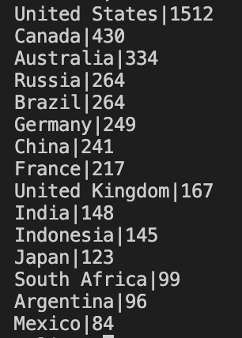
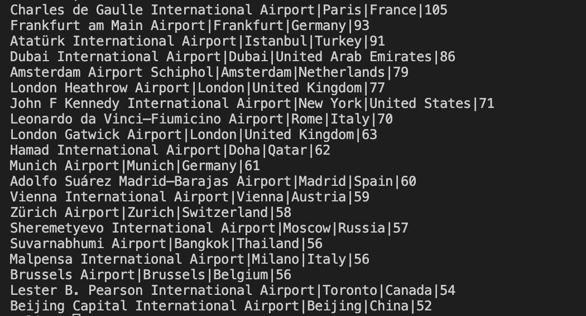
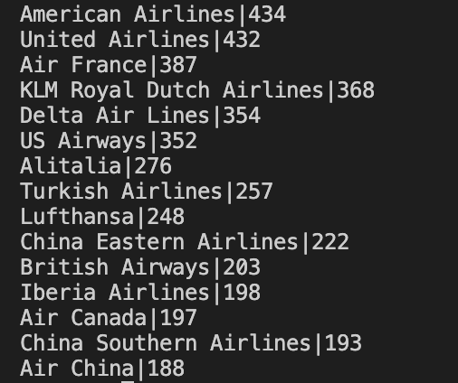
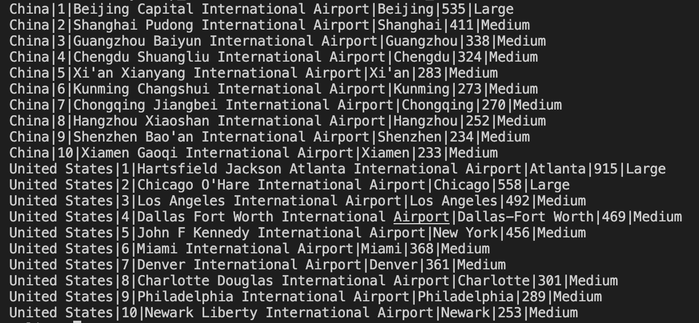
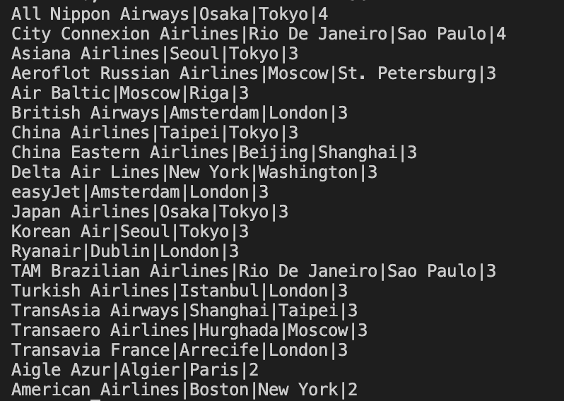

[](https://github.com/lingyuehao/sql_guidebook/actions/workflows/blank.yml)

# sql_guidebook
## Data Source – OpenFlights Global Database
This project uses data from the OpenFlights Database — a publicly available, UTF-8 encoded dataset that provides comprehensive information about global airports, airlines, aircraft, and flight routes. The dataset is open for non-commercial and educational use under the Open Database License (ODbL).
The version used in this project includes four main tables:

### 🛫 airports

Contains details about over 10,000 airports worldwide.
#### Key fields:
airport_id, name, city, country, iata, icao, latitude, longitude, altitude, timezone, dst, tz_database_timezone, type, source
#### Purpose: Provides the geographic and operational metadata for each airport used in route analysis.

### 🏢 airlines
Contains information on 5,888 airlines, including active and defunct carriers.
#### Key fields:
airline_id, name, alias, iata, icao, callsign, country, active
#### Purpose: Identifies the airline operators of each route and supports airline-based aggregations and joins.

### 🌐 routes
Includes 67,663 flight routes operated by 548 airlines between 3,321 airports.
#### Key fields:
airline, airline_id, source_airport, source_airport_id, destination_airport, destination_airport_id, codeshare, stops, equipment
#### Purpose: Represents the directional flight network connecting airports and airlines. Each record indicates one-way service (A → B).

### ✈️ planes
Contains a curated list of 173 passenger aircraft types.
#### Key fields:
name, iata_code, icao_code
#### Purpose: Supports the analysis of aircraft usage across routes and airlines.

## SQL queries, explanations, and results
### Query 1: Top 15 Countries by Number of Airports
#### SQL Command:
```bash
SELECT country, COUNT(*) AS airport_count
FROM airports
GROUP BY country
ORDER BY airport_count DESC
LIMIT 15;
```
#### Explanation:
This query finds which countries have the most airports in the OpenFlights dataset. I grouped all airport records by their country and counted how many airports each country has using COUNT(*). Then, I sorted them in descending order to show the top 15. The result shows that the United States overwhelmingly leads with 1,512 airports, which makes sense given its size and strong domestic air network. Canada (430) and Australia (334) follow, both being large countries with many regional airports spread across wide territories. Other countries like China (241), Germany (249), and France (217) also appear high on the list, reflecting their strong air transport infrastructure. One thing to note is that the data might slightly differ from current real-world numbers because the OpenFlights dataset hasn’t been updated since 2017. Still, the overall pattern aligns with global aviation density — larger countries or those with developed economies tend to have more airports.

#### Result:



### Query 2: Most “International” Airports by Distinct Destination Countries (Top 20)
#### SQL Command:
```bash
WITH dests AS (
  SELECT source_airport_id, dst.country AS dest_country
  FROM routes r
  JOIN airports dst ON r.destination_airport_id = dst.airport_id
)
SELECT ap.name AS airport_name, ap.city, ap.country,
       COUNT(DISTINCT dest_country) AS destination_countries
FROM dests
JOIN airports ap ON dests.source_airport_id = ap.airport_id
GROUP BY ap.airport_id
ORDER BY destination_countries DESC
LIMIT 20;
```
#### Explanation:
This query identifies which airports connect to the largest number of different countries, essentially showing the world’s most internationally connected hubs. I started by using a Common Table Expression (CTE) called dests to extract each flight’s source airport and the destination country it serves. Then, in the main query, I joined that result back to the airports table to retrieve airport names, cities, and countries. By grouping results by each airport’s ID and counting distinct destination countries, I was able to see which airports reach the broadest range of nations directly.

This approach makes sense because counting distinct destination countries (instead of total routes) captures how globally connected an airport is, without over-counting multiple flights to the same country. The output shows that Charles de Gaulle Airport (Paris) ranks first, serving flights to 105 countries. It is followed by Frankfurt (Germany, 93) and Istanbul Atatürk (Turkey, 91)—all of which are major global transfer points. Airports like Dubai (86), Amsterdam Schiphol (79), and London Heathrow (77) also stand out as major intercontinental connectors. Interestingly, New York JFK appears with 71 destination countries, reflecting its strong trans-Atlantic presence, while Beijing Capital connects to 52 countries—showing significant but still more regionally concentrated coverage. Overall, the results align well with real-world expectations: European hubs dominate because of their geographic position between continents, while major airports in Asia and the Middle East play key roles in connecting East–West routes.

#### Result:



### Query 3: Number of Airports Served by Each Airline (Top 15)
#### SQL Command:
```bash
WITH all_airports AS (
  SELECT airline_id, source_airport_id AS airport_id FROM routes
  UNION
  SELECT airline_id, destination_airport_id FROM routes
)
SELECT a.name AS airline_name, COUNT(DISTINCT airport_id) AS airports_served
FROM all_airports aa
JOIN airlines a ON a.airline_id = aa.airline_id
GROUP BY a.name
ORDER BY airports_served DESC
LIMIT 15;
```
#### Explanation:
This query explores which airlines operate across the largest number of airports worldwide. I began by creating a CTE called all_airports that merges both the source and destination airports from the routes table using a UNION, ensuring each airport is only counted once per airline. Then I joined this combined table with the airlines table to match each airline’s name. After grouping by airline, I used COUNT(DISTINCT airport_id) to calculate how many unique airports each airline serves, and sorted the results in descending order to identify the top 15. 

The results show that American Airlines and United Airlines dominate globally, each serving over 430 airports, followed by Air France, KLM, and Delta Air Lines. These findings reflect the scale of major U.S. and European carriers, which maintain extensive domestic and international networks. Interestingly, Chinese airlines such as China Eastern, China Southern, and Air China also appear in the top ranks, showing their growing reach within Asia and beyond.  

#### Result:



### Query 4: China and United States – Top Departure Hubs with Hub Size Labels
#### SQL Command:
```bash
WITH dep AS (
  SELECT
    r.source_airport_id AS airport_id,
    COUNT(*) AS dep_cnt
  FROM routes r
  GROUP BY r.source_airport_id
),
ranked AS (
  SELECT
    ap.country,
    ap.name AS airport_name,
    ap.city,
    dep.dep_cnt,
    ROW_NUMBER() OVER (
      PARTITION BY ap.country
      ORDER BY dep.dep_cnt DESC
    ) AS rn,
    CASE
      WHEN dep.dep_cnt >= 1500 THEN 'Mega hub'
      WHEN dep.dep_cnt >= 500  THEN 'Large'
      WHEN dep.dep_cnt >= 200  THEN 'Medium'
      ELSE 'Small'
    END AS hub_size
  FROM dep
  JOIN airports ap ON ap.airport_id = dep.airport_id
  WHERE ap.country IN ('China', 'United States')
)
SELECT country, rn, airport_name, city, dep_cnt, hub_size
FROM ranked
WHERE rn <= 10                     
ORDER BY country, dep_cnt DESC;
```
#### Explanation:
This query compares the top departure hubs in China and the United States, showing how large and active each airport is based on the number of outbound routes. First, I created a CTE dep to count how many departure routes (dep_cnt) each airport has from the routes table. Then, I joined it with the airports table to get airport names, cities, and countries. Using ROW_NUMBER() with PARTITION BY country, I ranked airports separately within each country by their number of departures. Finally, I used a CASE WHEN statement to categorize hub sizes as Mega, Large, Medium, or Small based on dep_cnt. 

The results show that Beijing Capital (535) is China’s largest hub, while Atlanta (ATL) leads in the U.S. with 915 routes. Both countries have multiple Medium hubs like Shanghai Pudong, Chengdu, Dallas-Fort Worth, and Los Angeles, reflecting how air traffic is spread across multiple cities rather than concentrated in one. This query effectively combines ranking, categorization, and filtering to highlight the structure of national air networks, showing that the U.S. has more high-capacity “mega” hubs, while China’s system has many balanced regional centers supporting strong domestic connectivity.

#### Result:



### Query 5: Top 10 Airlines and Their Most Used Aircraft Models (Usage Trend Comparison)
#### SQL Command:
```bash
WITH plane_usage AS (
  SELECT
      a.name AS airline_name,
      COALESCE(NULLIF(p.name, '\N'), '(Unknown Plane)') AS plane_name,
      COUNT(r.route_id) AS route_count
  FROM routes r
  JOIN airlines a ON r.airline_id = a.airline_id
  JOIN planes p ON TRIM(p.iata) = TRIM(SUBSTR(r.equipment, 1, 3))
  GROUP BY a.name, p.name
),
ranked AS (
  SELECT
      airline_name,
      plane_name,
      route_count,
      RANK() OVER (PARTITION BY airline_name ORDER BY route_count DESC) AS rank_within_airline,
      LAG(route_count) OVER (PARTITION BY airline_name ORDER BY route_count DESC) AS prev_usage,
      LEAD(route_count) OVER (PARTITION BY airline_name ORDER BY route_count DESC) AS next_usage
  FROM plane_usage
),
top_airlines AS (
  SELECT airline_name
  FROM plane_usage
  GROUP BY airline_name
  ORDER BY SUM(route_count) DESC
  LIMIT 10
)
SELECT
  r.airline_name,
  r.plane_name,
  r.route_count,
  COALESCE(r.prev_usage - r.route_count, 0) AS diff_from_prev,
  COALESCE(r.route_count - r.next_usage, 0) AS diff_from_next
FROM ranked r
JOIN top_airlines t ON r.airline_name = t.airline_name
WHERE r.rank_within_airline = 1
ORDER BY r.route_count DESC;
```

#### Explanation:
This query finds, for the top 10 airlines by total route volume, the single most-used aircraft model and compares its usage to the next models using window functions. I first build plane_usage by joining routes → airlines and planes, mapping each route’s equipment to a plane via TRIM(SUBSTR(r.equipment,1,3)) = p.iata, then counting routes per (airline, plane) and cleaning missing names with COALESCE(NULLIF(p.name,'\\N'),'(Unknown Plane)'). In ranked I rank planes within each airline by route_count and compute LAG/LEAD to get usage gaps versus the previous/next models. I also compute top_airlines by summing route counts and keeping the 10 busiest carriers. The final select keeps the #1 plane per airline (rank_within_airline = 1) and reports the count plus the gaps to the #2/#0 positions. 

Results show patterns that match reality: e.g., Ryanair → Boeing 737-800 (2,484 routes) far ahead of any other type (gaps ~0/0 because it dominates), easyJet → Airbus A319 (765) with a sizable trailing gap to the next type, and major Chinese and U.S. carriers relying heavily on A320 or 737-800 families (e.g., China Eastern → A320 (500), Air China → 737-800 (499), American → 737-800 (264)).

#### Result:


### Query 6: Top 20 City Pair per Airline (with frequency)
#### SQL Command:
```bash
WITH city_pairs AS (
  SELECT
    r.airline_id,
    COALESCE(NULLIF(TRIM(src.city), ''), '(unknown)') AS src_city,
    COALESCE(NULLIF(TRIM(dst.city), ''), '(unknown)') AS dst_city,
    COUNT(*) AS pair_cnt
  FROM routes r
  JOIN airports src ON r.source_airport_id      = src.airport_id    
  JOIN airports dst ON r.destination_airport_id = dst.airport_id    
  GROUP BY r.airline_id, src_city, dst_city
),

ranked AS (
  SELECT
    cp.airline_id,
    cp.src_city,
    cp.dst_city,
    cp.pair_cnt,
    ROW_NUMBER() OVER (
      PARTITION BY cp.airline_id
      ORDER BY cp.pair_cnt DESC, cp.src_city, cp.dst_city
    ) AS rn
  FROM city_pairs cp
)

SELECT
  COALESCE(NULLIF(a.name, '\N'), '(Unknown Airline)') AS airline_name,
  r.src_city,
  r.dst_city,
  r.pair_cnt AS flights_between_cities
FROM ranked r
JOIN airlines a ON a.airline_id = r.airline_id
WHERE r.rn = 1                    
ORDER BY flights_between_cities DESC
LIMIT 20; 
```

#### Explanation:
This query asks: for each airline, which city-pair is flown the most, and what’s the flight count? I first join routes to the airports table twice—once for the source airport (src) and once for the destination (dst)—to convert airport IDs into city names. I clean missing or blank cities with COALESCE(NULLIF(TRIM(city), ''), '(unknown)'). Then I aggregate to the city-pair level per airline (GROUP BY airline_id, src_city, dst_city) to get a frequency (pair_cnt). Using a window function, ROW_NUMBER() OVER (PARTITION BY airline_id ORDER BY pair_cnt DESC, …), I rank pairs within each airline and keep only the top one (rn = 1). Finally I join to airlines to display the carrier name and sort by the busiest pairs globally, returning the top 20. 

The results highlight classic shuttle corridors and regional staples—e.g., Osaka–Tokyo (All Nippon, Japan Airlines), Amsterdam–London (British Airways, easyJet, Transavia), Seoul–Tokyo (Asiana, Korean Air), Beijing–Shanghai (China Eastern), and Boston–New York / New York–Washington (American, Delta). These patterns make sense: they connect large population and business centers with high frequency, often served by multiple carriers.

#### Result:

